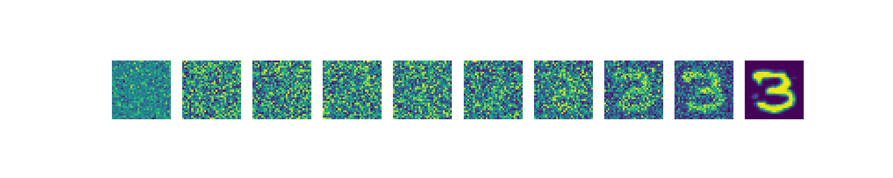
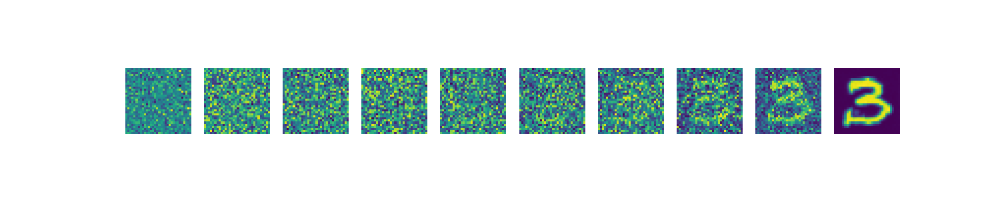
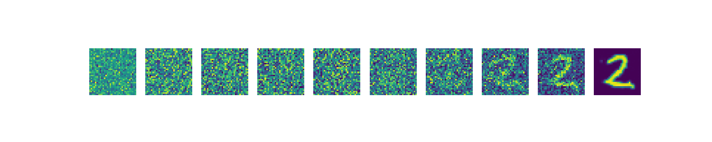
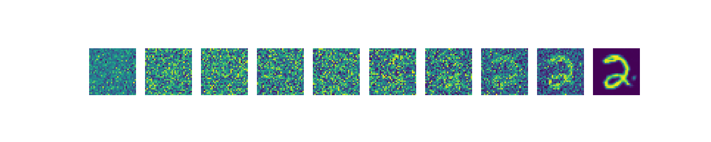

# Denoising Diffusion Probabilistic Models

## Dependencies
You can either create a new conda environment using the `environment.yml` file

```bash
conda env create -f environment.yml
```

Alternativelt, install dependencies via `pip` using the `requirements.txt` file. Note that we used `python==3.11.14` for this project.

```bash 
pip install -r requirements.txt
```

## Code structure

```
.
├── README.md
├── config
│   └── mnist.yml
├── data
│   ├── __init__.py
│   └── mnist_dataloader.py
├── environment.yml
├── loss
│   ├── __init__.py
│   └── losses.py
├── model
│   ├── __init__.py
│   └── unet.py
├── requirements.txt
├── sampling_mean_predictor.py
├── sampling_noise_predictor.py
└── train.py
```

## Training
For training the model, you can directly run the following command:
```bash
python train.py --config_file config/mnist.yml
``` 

An example of the expected config file can be seen in `config/mnist.yml`

## Sampling
The sampling strategy depends on the loss the model is trained on. Run the correct code accordingly.

If the model is trained on the `'noise_prediction_loss'`:
```bash
python sampling_noise_predictor.py
```

If the model is trained on the `'mean_predictor_loss'`:
```bash
python sampling_mean_predictor.py
```

## Config files

Following is the description of the parameters:

**Model Parameters**

* `resolutions_list`: The list of downsampling resolutions up until the the bottleneck layer in UNet. The same resolutions will be used in reverse order for the upsampling layers.

* `in_channels`: Number of channels in the input images.

* `out_channel_multipliers`: List containing the multiplier for the number of channel per resolution. (`len(resolutions_list) == len(out_channel_multipliers)`)

* `starting_channels`: Starting number of channels to which the input image should be transformed to.

* `num_resnet_blocks`: Number of resnet blocks to be used for each resolution.

* `attention_resolutions`: List of the resolutions at which attention mechanism should be applied.

* `T`: The total noising/denoising steps for diffusion.

* `T_dim`: Dimension of the embedding corresponding to the diffusion time step.

**Training Parameters**
* `lr` : Learning rate

* `epochs`: Number of epochs

* `batch_size`: Batch size

* `loss`: The specific instantiation of the diffusion loss function to be used to train. The examples of the loss functions can be found in `loss/losses.py`. This field should be a string and should be one of: `'variational_lower_bound_loss'`, `'noise_predictor_loss'`.

* `checkpoint_folder`: Path of the folder where the trained UNET checkpoint should be stored.

**Diffusion parameters**:

* `beta_1`: Starting value of the noise variance schedule.

* `beta_T`: Ending value of the noise variance schedule.

* `T`: The total noising/denoising steps for diffusion.

## Generated examples

Following are a few images sampled from our model which was trained for 50 epochs on a dataset consisting of digits 1, 2 and 3 from the MNIST dataset.







## To Do:
* ~~Pass config as an argument.~~
* ~~Create a single file for sampling and use loss function and config as arguments.~~
* ~~Create argument to decide the classes of digits to train on rather than hardcoding it inside the dataloader.~~
* Add more datasets (CIFAR10, CelebA).
* Add evaluation scripts.
* Add score-generation loss.
* Add conditional generation.
* Delete train_learned_variance.py, sampling_mean_prediction.py sampling_noise_prediction.py files once fully checked.

